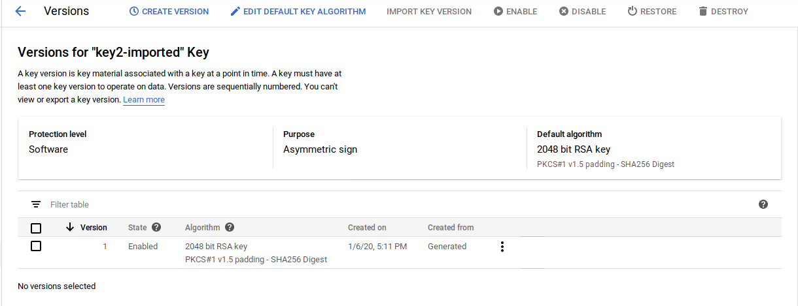

# Google Cloud KMS based Service Accounts for Authentication and SignedURLs

Tutorial on using a Google Cloud KMS key as a Service Account.

There are two ways to associate a Service Account with a KMS key:

1. Create a private key within KMS and then associate a Service Account with it.
or
2. Create a Service Account keypair; export the private key and import that key into KMS.

Once the Serivce Account private key is within KMS, you can do several things:

1. Authenticate as that service account to a variety of GCP Services
2. Generate a [GCS SignedURL](https://cloud.google.com/storage/docs/access-control/signed-urls) (or generally sign some data)

Ofcourse not matter what you do, you must have IAM access to the KMS key itself before you do anything.  In the case where you're authenticating against a GCP API, you could just have direct access to the target resource but if policies madate you need to use KMS based keys for some reason, you can use this procedure (note, if you just want to impersonate a service account itself to sign or authenticate, consider [Impersonated TokenSOurce](https://github.com/salrashid123/oauth2#usage-impersonatedcredentials))

>> Note: this code is *NOT* supported by Google.  _caveat empotor_

## Core library implementation: cryto.Signer for KMS

The core library used in this sample is an implementation of the [crypto.Signer](https://golang.org/pkg/crypto/#Signer) interface in golang for KMS.  The `Signer` implementation allows developers to use higher-level golang constructs to do a variety of things that rely on cryptographic signing such as using `net/http` directly for mTLS.  However, in our case, we will use the signing interface to generate a [SignedURL](https://cloud.google.com/storage/docs/access-control/signed-urls) and also use it within [oauth2 TokenSource](https://godoc.org/golang.org/x/oauth2#TokenSource) that relies on serive account signatures for authentication.

For reference, see:

- GCP Authentication
  - [KMSTokenSource](https://github.com/salrashid123/oauth2#usage-kmstokensource)

- KMS based Signer:
  - [https://github.com/salrashid123/signer](https://github.com/salrashid123/signer)
  - [KMS golang Signer](https://github.com/salrashid123/kms_golang_signer)

- KMS based mTLS
  - [mTLS with KMS](https://medium.com/google-cloud/mtls-with-google-cloud-kms-fb17f3ed8219)


### Setup

The steps below will setup two KMS keys:  (1) one where you first generate a service account keypair and then import it into KMS and (2) one where you generate the a key within KMS and then associate it to an ServiceAccount.

In the first technique, the private key for a service account is exposed outside of KMS control (i.e, the private key at one point exists on disk).  In the second, the private key never exists out of KMS control.  The second option is significantly better since the chain of custoday of the key becomes irrelevant.  However, you must ensure the association step to link the public certificate for the service account to the KMS key is carefully controlled.

Anyway, perform the following steps in the same shell (since we use several env-vars together)

1) first setup some environment variables
```bash
export PROJECT_ID=`gcloud config get-value core/project`
export PROJECT_NUMBER=`gcloud projects describe $PROJECT_ID --format="value(projectNumber)"`
export SERVICE_ACCOUNT_EMAIL=kms-svc-account@$PROJECT_ID.iam.gserviceaccount.com
```

2) create a service account (we will need this later)

```bash
gcloud iam service-accounts create kms-svc-account --display-name "KMS Service Account"
gcloud iam service-accounts describe $SERVICE_ACCOUNT_EMAIL
```

3) create a bucket and topic to test authentication:

```bash
export BUCKET_NAME=$PROJECT_ID-bucket
export TOPIC_NAME=$PROJECT_ID-topic

gsutil mb gs://$BUCKET_NAME
echo bar > foo.txt
gsutil cp foo.txt gs://$BUCKET_NAME/
gcloud pubsub topics create $TOPIC_NAME
```

4) Allow the service account access to gcs and pubsub

```bash
 gcloud projects add-iam-policy-binding $PROJECT_ID     --member=serviceAccount:$SERVICE_ACCOUNT_EMAIL    --role=roles/storage.admin
 gcloud projects add-iam-policy-binding $PROJECT_ID     --member=serviceAccount:$SERVICE_ACCOUNT_EMAIL    --role=roles/pubsub.admin
```

5) create a keyring:

```bash
export LOCATION=us-central1
export KEYRING_NAME=mycacerts
export KEY_NAME=key1

gcloud kms keyrings create $KEYRING_NAME --location=$LOCATION
```

---

### Import Service Account Private Key to KMS (SA -> KMS)

In this mode, you first generate a keypair for a Service Account, download it and then import it into KMS as described in [Importing a key into Cloud KMS](https://cloud.google.com/kms/docs/importing-a-key).

The specific steps to follow are:

a. Download `.p12` key and convert to `pem`
b. Create ImportJob
c. Format  `pem` key for import
d. Import formatted key to kms via importJob
e. Delete the `.p12` and `.pem` files on disk


A) Create Service Account Key as .p12

```bash
$ gcloud iam service-accounts keys create svc_account.p12 --iam-account=$SERVICE_ACCOUNT_EMAIL --key-file-type=p12
```

for example:
```bash
$ gcloud iam service-accounts keys list --iam-account=$SERVICE_ACCOUNT_EMAIL
KEY_ID                                    CREATED_AT            EXPIRES_AT
ce4ceffd5f9c8b399df9bf7b5c13327dab65f180  2020-01-07T00:11:07Z  9999-12-31T23:59:59Z <<<<<<<<  this is the new key
1f1a216c7e08119926144ad443e6a8e3ec5b9c59  2020-01-07T00:05:47Z  2022-01-13T10:00:31Z
```

Convert to PEM

```bash
$ openssl pkcs12 -in svc_account.p12  -nocerts -nodes -passin pass:notasecret | openssl rsa -out privkey.pem
```

B) Create ImportJob

Since we already cretae the keyring in the setup steps, we will just create the import job

```bash
export IMPORT_JOB=saimporter
export VERSION=1


$ gcloud beta kms import-jobs create $IMPORT_JOB \
  --location $LOCATION \
  --keyring $KEYRING_NAME \
  --import-method rsa-oaep-3072-sha1-aes-256 \
  --protection-level hsm


$ gcloud kms import-jobs describe $IMPORT_JOB \
  --location $LOCATION \
  --keyring $KEYRING_NAME
```

C) Format  `pem` key for import

```bash
$ openssl pkcs8 -topk8 -nocrypt -inform PEM -outform DER     -in privkey.pem     -out formatted.pem
```

D) Import formatted via importJob

```bash
$ gcloud kms keys create $KEY_NAME --keyring=$KEYRING_NAME --purpose=asymmetric-signing  --default-algorithm=rsa-sign-pkcs1-2048-sha256 --skip-initial-version-creation --location=$LOCATION --protection-level=hsm

$ gcloud kms keys versions import   --import-job $IMPORT_JOB   --location $LOCATION   --keyring $KEYRING_NAME   --key $KEY_NAME   --algorithm rsa-sign-pkcs1-2048-sha256   --target-key-file formatted.pem
```

The service account key should now exists within KMS:


Finally, enable KMS key audit logs so we can see how its being used:


#### Test

Edit Test client `main.go` and update the the variables defined shown in the `var()` area. Note, `keyId` is optional

Run test client

```bash
go run main.go
```

You should see the output sequence:

a) A signed URL

```
$ go run main.go 

2020/01/06 16:52:38 https://storage.googleapis.com/your_project/foo.txt?X-Goog-Algorithm=GOOG4-RSA-SHA256&X-Goog-Credential=kms-svc-account%40yourproject.iam.gserviceaccount.com%2F20200107%2Fauto%2Fstorage%2Fgoog4_request&X-Goog-Date=20200107T005237Z&X-Goog-Expires=599&X-Goog-Signature=27redacted&X-Goog-SignedHeaders=host
```

b) Response from an HTTP GET for that signedURL.  

In our case its the content of the file we uploaded earlier as well as a `200 OK` (which means the signedURL worked)

```
2020/01/06 16:52:38 SignedURL Response :
 bar
2020/01/06 16:52:40 Response: 200 OK
```

c) List of the pubsub topics for this project
```
2020/01/06 16:52:41 Topic: sd-test-246101-topic
```

d) List of the buckets on this project
```
2020/01/06 16:52:42 sd-test-246101-bucket
```

Finally, since we enabled audit logging, you should see the KMS API calls that got invoked.

In this case its two invocations:  one for the SignedURL and one for the other cloud services apis:


---


### Import KMS Public Certificate as Service Account (KMS -> SA)

The follwoing procedure generates a key in KMS and associates its public certificte with a given ServiceAccount.  This procedure is basically describe here:
- [Uploading public keys for service accounts](https://cloud.google.com/iam/docs/creating-managing-service-account-keys#uploading)

a. Create a keyring 
   (if you haven't done so already)
b. Create a key with KMS keymaterial/version
c. Generate `x509` certificate for KMS key
d. Create ServiceAccount
   (if you havent done so already)
e. Associate `x509` certificate with ServiceAccount


Jumping straight to

B) Create a key with KMS keymaterial/version

```bash
export KEY2_NAME=key2-imported

gcloud kms keys create $KEY2_NAME --keyring=$KEYRING_NAME --purpose=asymmetric-signing  --default-algorithm=rsa-sign-pkcs1-2048-sha256  --location=$LOCATION 
```
>> note, unlike the key that we imported, this does not require HSM (i.,e you can omit `--protection-level=hsm`)



C) Generate `x509` certificate for KMS key

ServiceAccount import requires a the public `x509` certificate but KMS does not surface an API for `x509` but rather the public `.pem` format for a kms key is all that is currently provided (see [cryptoKeyVersions.getPublicKey](https://cloud.google.com/kms/docs/retrieve-public-key))

However, since we've setup a `crypto.Singer` for cloud KMS, we can use it to genreate an x509 certificate pretty easily.  

Download `certgen.go`:

```bash
 wget https://raw.githubusercontent.com/salrashid123/signer/master/certgen/certgen.go
```

Edit the certgen and specify the variables you used for your project.  Note the keyname here can be `key2-imported`

```golang
	r, err := salkms.NewKMSCrypto(&salkms.KMS{
		ProjectId:  "yourproject",
		LocationId: "us-central1",
		KeyRing:    "mycacerts",
		Key:        "key2-imported",
		KeyVersion: "1",
	})
```

Generte the x509 cert:

```bash
$ go run certgen.go --cn=$SERVICE_ACCOUNT_EMAIL
2020/01/06 17:17:27 Creating public x509
2020/01/06 17:17:28 wrote cert.pem
```

Note the certificate is x509 (the cn doens't atter but i've set it to the service account name)

```bash
$ openssl x509 -in cert.pem -text -noout
Certificate:
    Data:
        Version: 3 (0x2)
        Serial Number:
            f0:6e:7b:cf:2c:72:0d:8d:f9:16:38:61:ec:1e:a9:2d
        Signature Algorithm: sha256WithRSAEncryption
        Issuer: C = US, ST = California, L = Mountain View, O = Acme Co, OU = Enterprise, CN = kms-svc-account@sd-test-246101.iam.gserviceaccount.com
        Subject: C = US, ST = California, L = Mountain View, O = Acme Co, OU = Enterprise, CN = kms-svc-account@sd-test-246101.iam.gserviceaccount.com
```

D) Associate `x509` certificate with ServiceAccount

The final step here is to upload and associate the public key with the service account we already created:

```bash
$ gcloud alpha iam service-accounts keys upload cert.pem  --iam-account $SERVICE_ACCOUNT_EMAIL
```

You should see a new `KEY_ID` suddenly show up.  In my case it was:
```
$ gcloud iam service-accounts keys list --iam-account=$SERVICE_ACCOUNT_EMAIL
KEY_ID                                    CREATED_AT            EXPIRES_AT
ce4ceffd5f9c8b399df9bf7b5c13327dab65f180  2020-01-07T00:11:07Z  9999-12-31T23:59:59Z
db8f0a5af9cf3bd211f4936ab7350788d4c774d8  2020-01-07T01:17:27Z  2021-01-06T01:17:27Z  <<<<<<<<<
1f1a216c7e08119926144ad443e6a8e3ec5b9c59  2020-01-07T00:05:47Z  2022-01-13T10:00:31Z
```

#### Test

Edit Test client `main.go` and update the the variables defined shown in the `var()` area. Note, `keyId` is optional.  Remember to update the `keyName` to `key2-imported` or whatever you setup earlier.

Run test client

```bash
go run main.go
```

The output should be similar to the first procedure.

woooo!!!


#### TPM and Yubikey based SignedURL and GCPAuthentication

You can redo the same procedure using a Trusted Platform Module (TPM) or even a Yubikey too!  I may add in an article about that shortly but for now, see:

- [TPM Signer](https://github.com/salrashid123/signer)
- [TPMTokenSource](https://github.com/salrashid123/oauth2#usage-tpmtokensource)
- [TPM2-TSS-Engine hello world and Google Cloud Authentication](https://github.com/salrashid123/tpm2_evp_sign_decrypt)

- [YubiKey based TokenSource and Signer](https://medium.com/google-cloud/how-to-get-google-credentials-from-a-yubikey-3ba2ca97721f)
